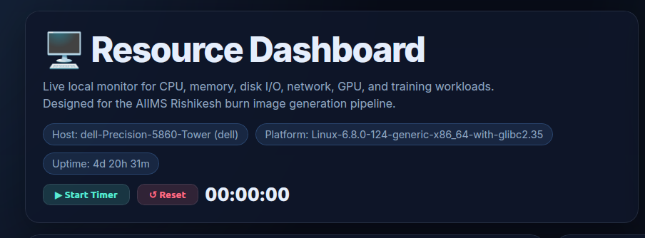

# Resource Dashboard



A native Linux desktop application and standalone HTTP server for live system resource monitoring. Built to monitor CPU, memory, GPU, disk I/O, and network activity during heavy workloads (like image generation and model training).

> [!NOTE]
> Currently, this application is only supported on Linux. Support for Windows and macOS is coming soon!

---

## 📸 Dashboard Gallery

### 1. System Overview


### 2. CPU & Memory Monitor


### 3. GPU Telemetry & Threshold Warnings


---

## ✨ Features

- **Gorgeous Glassmorphism UI:** Features animated ring gauges, smooth number transitions, and a dark/light theme toggle.
- **Robust Architecture:** Backend Python server with proper logging, dynamic configuration (`config.ini`), and a decoupled HTML template.
- **Security First:** Includes Basic Authentication support, XSS vulnerability fixes, and strict CORS headers.
- **GPU Telemetry:** Tracks GPU core/memory utilization, temperatures, power draw, and fan speed (via `nvidia-smi`) with optimized caching, plus per-GPU trend tabs on multi-GPU systems.
- **CPU & Memory:** Per-core CPU heatmap, IO-wait tracking, detailed memory stats, and an overall System Health score (hover the score for a per-metric breakdown).
- **Disk & Network:** Disk I/O read/write rates and network rx/tx throughput.
- **Process Management:** Sortable, filterable top-processes table with a one-click kill button (guarded against killing the dashboard itself or system-critical PIDs), and per-process GPU memory usage merged in when a process is running compute on the GPU.
- **Alerts & Notifications:** Custom threshold UI for alerts (persisted across reloads), historical alert log, desktop notifications when the GPU drops to idle, and an optional server-side webhook so alerts reach you even with the tab closed.
- **Export & History:** Download historical metrics as a CSV file, export just the current training-timer session, view metric tooltips on chart hover, and browse long-term history (up to 30 days) in-app via the **📈 History** modal — pick a metric and a time range (1h/6h/24h/7d/30d) and export that exact range as CSV.
- **Monitoring Integrations:** A Prometheus-compatible `/metrics` endpoint for scraping into Grafana or any Prometheus-based stack, plus a toolbar badge showing whether the server-side alert webhook is active and when it last fired.
- **Resilient UX:** Connection-lost banner with retry status and an initial loading state, so a dropped server connection is never silently stale.
- **Accessible:** ARIA labels on gauges/live regions and non-color-only cues for alert states.
- **UI Polish:** Theme-aware chart colors (separate palettes tuned for dark/light contrast), an expand toggle to widen the Top Processes table to full width, GPU-active rows highlighted in the process table, and "⤢" expand icons on every trend chart that jump straight into the History modal for that metric.
- **Headless / Server Mode:** Runs with zero GUI dependencies; ships a systemd service template for running as a background service that survives logout/reboot.
- **Native Desktop App:** GTK3 + WebKit2 wrapper offering window state persistence, minimize-to-tray, system tray icon, keyboard shortcuts, always-on-top pinning, and fullscreen mode.

## 🛠 Prerequisites

To get full functionality (especially the GPU telemetry), your system should have the NVIDIA driver utilities installed:
- `nvidia-smi` must be accessible via your terminal. *(If this is missing, the dashboard will still function perfectly but will omit the GPU section).*

## 🚀 Installation (Linux)

### Method 1: Using the `.deb` Package (Recommended for Debian/Ubuntu)

1. **[Download the latest `.deb` package](https://github.com/Abhishek-Durgude/Resource-Monitor/raw/main/resource-dashboard_1.2-2_all.deb)** from this repository.
2. Install it using `apt` (this automatically handles required dependencies):
   ```bash
   sudo apt install ./resource-dashboard_1.2-2_all.deb
   ```
3. You can now launch it from your application menu or terminal!

### Method 2: Manual Installation Script

If you aren't on a Debian-based system or prefer a manual script:

1. Clone or download this repository.
2. Run the installer script:
   ```bash
   bash install_dashboard.sh
   ```
3. The installer will check for missing dependencies (`gir1.2-webkit2-4.0`, etc.) and install them, add a desktop entry so you can find it in your app launcher, and create a terminal shortcut.

## 💻 Usage

**From your app launcher:**
Search for "Resource Dashboard" and open it.

**From the terminal:**
```bash
resource-dashboard
```

**Options:**
```bash
resource-dashboard --root /data/datasets   # Monitor a specific disk path
resource-dashboard --top 12                # Show top 12 processes instead of 8
resource-dashboard --zoom 0.85             # Set initial UI zoom to 85%
```

## ⌨️ Keyboard Shortcuts

When the dashboard is open, you can use these shortcuts:
- `Ctrl + R`: Reload the dashboard
- `Ctrl + =`: Zoom In
- `Ctrl + -`: Zoom Out
- `Ctrl + 0`: Reset Zoom
- `F11`: Toggle Fullscreen
- `Ctrl + Q`: Quit Application

## 📡 API & Integrations

| Endpoint | Method | Purpose |
|---|---|---|
| `/api/metrics` | GET | Live snapshot used by the dashboard UI (JSON). |
| `/api/history` | GET | Long-term history from SQLite. Query params: `since`, `until` (unix seconds), `limit` (default 2000, max 20000), `format=csv` for a CSV download instead of JSON. Powers the in-app History modal. |
| `/api/export_csv` | GET | Download in-memory metrics as CSV. Optional `?since=<unix ts>` to export just one session. |
| `/api/kill_process` | POST | `{"pid": 1234, "signal": "TERM"}` — see [Process Kill Safety](#-process-kill-safety) below. |
| `/metrics` | GET | Prometheus text-exposition format, for scraping with Prometheus/Grafana. |

All endpoints honor `--auth` the same way the dashboard page does.

**Prometheus scrape config example:**
```yaml
scrape_configs:
  - job_name: resource-dashboard
    static_configs:
      - targets: ["127.0.0.1:8765"]
    metrics_path: /metrics
    # basic_auth: {username: user, password: pass}   # if --auth is set
```

## ⚙️ Configuration (`~/.config/resource-dashboard/config.ini`)

```ini
[Server]
host = 127.0.0.1
port = 8765
auth = user:pass

[Alerts]
webhook_url = https://hooks.slack.com/services/...   ; or any URL accepting a JSON POST
cooldown_seconds = 900                                 ; minimum time between repeat alerts for the same condition
cpu_percent = 95
mem_percent = 90
gpu_temp_c = 85
iowait_percent = 30
```

The `[Alerts]` section is entirely optional. When `webhook_url` is set, the server independently evaluates the same thresholds server-side (not just in the browser) and POSTs `{"host", "timestamp", "alerts": [...]}` to that URL whenever a threshold is newly crossed — so you get notified even if no browser tab is open. Point it at a Slack incoming webhook, [ntfy.sh](https://ntfy.sh), or your own relay.

## 🩺 Headless / systemd Service Mode

`resource_dashboard.py` has no GUI dependencies, so it can run as a background service independent of the GTK desktop app — useful for checking a machine's status from another device on your LAN, or keeping metrics/alerts flowing across logout and reboot.

```bash
sudo cp packaging/resource-dashboard@.service /usr/lib/systemd/system/
sudo systemctl daemon-reload
sudo systemctl enable --now resource-dashboard@$USER
```

This runs the server as your user (`User=%i`) with `--no-browser`. Configure host/port/auth/alerts via `~/.config/resource-dashboard/config.ini` as shown above.

## 🧪 Running Tests

```bash
python3 -m unittest discover -s tests -v
```

Covers the pure logic functions (threshold evaluation, CSV/history filtering, Prometheus rendering, kill-process safety guards) without touching real `/proc` files or the network.

## 🗑 Uninstallation

If you installed via the `.deb` package, you can cleanly remove the dashboard with:
```bash
sudo apt remove resource-dashboard
```

## 🔒 Process Kill Safety

The process table's kill button calls a local `/api/kill_process` endpoint. It refuses to signal PID 0/1 or the dashboard server's own process, but it otherwise sends the requested signal to any PID your user has permission to kill — use it deliberately. If you bind the dashboard beyond `127.0.0.1` (e.g. `--host 0.0.0.0`), always pair it with `--auth user:pass`.

## 🙌 Credits

Developed by **Clixzsera Lab** · Abhishek Durgude
